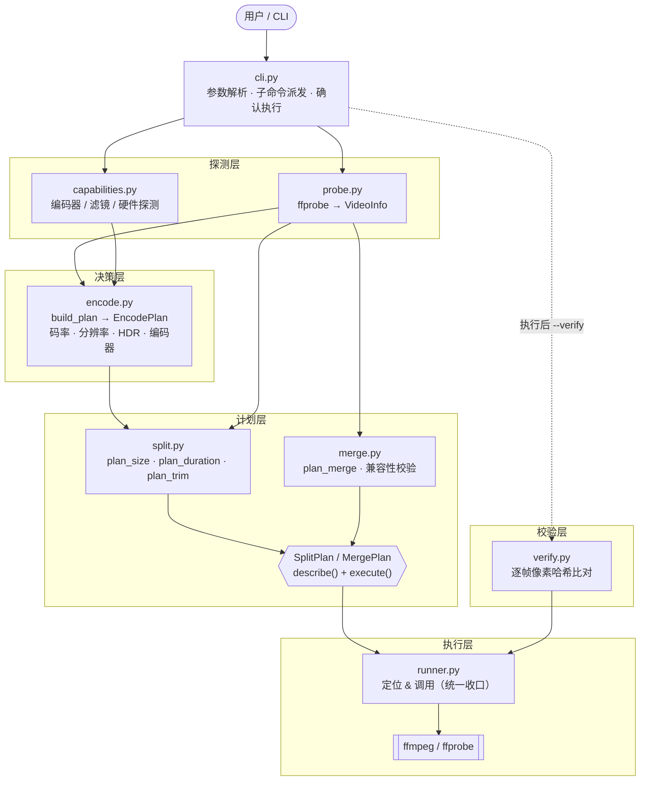
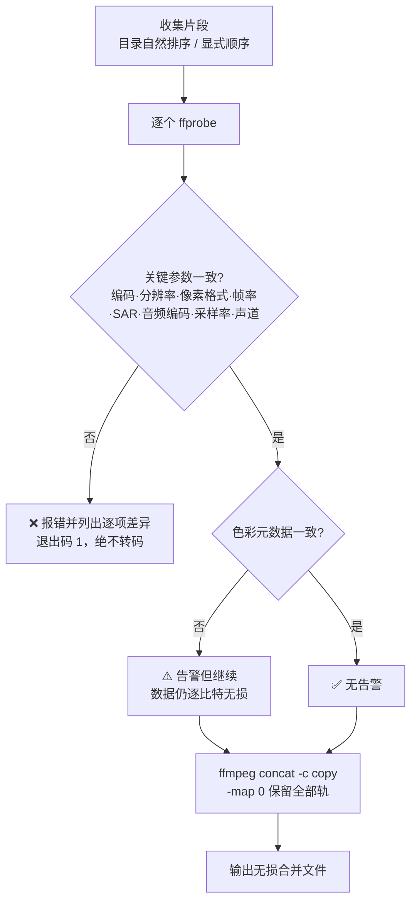
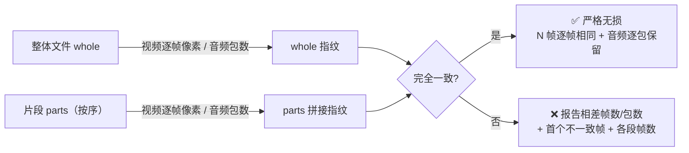

# vclip —— 通用视频切分 / 重组工具


-brightgreen.svg)


把长视频**切成多个小片段**、**裁剪出一个子片段**，或把片段**严格无损**拼回一个视频。
底层调用 `ffmpeg` / `ffprobe`，本体零 Python 第三方依赖。

> **设计原则：无损优先，绝不静默转码。** `merge` 只做流复制（`-c copy`）。
> 一旦发现片段的关键参数不一致（会破坏拼接），**直接报错并列出差异**，
> 交给你处理，绝不偷偷重编码把问题藏起来。

---

## 目录

- [能力一览](#能力一览)
- [架构](#架构)
- [安装](#安装)
- [命令手册（可直接复制）](#命令手册可直接复制)
- [子命令与选项详解](#子命令与选项详解)
- [无损校验（两道防线）](#无损校验两道防线)
- [无损 vs 转码](#无损-vs-转码)
- [⚠️ 坑点与边界（务必一读）](#️-坑点与边界务必一读)
- [HDR 处理](#hdr-处理)
- [开发 / 测试](#开发--测试)

---

## 能力一览

| 能力 | 命令 | 说明 |
| --- | --- | --- |
| **无损重组** | `merge` | 严格 `-c copy` 拼接；参数不一致直接报错，**绝不偷偷转码** |
| **按大小切分** | `size` | 每段 ≤ 目标 MB；默认转码（大小可控），可 `--lossless` |
| **按时长切分** | `duration` | 每段 N 秒；默认无损 `-c copy`（极快），可 `--transcode` |
| **裁剪子片段** | `trim` | 取出 `[from, to]` 区间；默认无损，可精确转码 |
| **无损校验** | `verify` / `--verify` | **逐帧像素级**证明"整体 == 片段拼接"，合并/切分通用 |
| **查看信息** | `info` | 分辨率/码率/HDR/SAR/音频等；`--json` 便于脚本 |
| **社交/分享预设** | `social` / `share` | 一键切成平台友好的 1080p H.264 |

底层特性：

- **跨平台硬件加速**：自动检测 videotoolbox(Apple) / nvenc(NVIDIA) / qsv(Intel) / amf(AMD)。
- **保留多轨**：无损操作默认 `-map 0`，多音轨 / 字幕原样保留。
- **并行转码**：`-j N` 多段同时编码，大文件显著提速。
- **能力自适应**：运行时探测 ffmpeg 能力，缺 tone-mapping 时自动降级并告警。
- **安全执行**：执行前打印计划并确认，支持 `--dry-run` / `-y`。

---

## 架构

分层清晰、单向依赖：**探测 → 决策 → 计划 → 执行**。每层只做一件事，
所有对 `ffmpeg`/`ffprobe` 的调用都收口到 `runner`，便于替换与测试。



### 模块职责

| 模块 | 职责 | 关键产物 |
| --- | --- | --- |
| `cli.py` | 命令行入口、子命令派发、打印计划并确认执行 | `main()` |
| `runner.py` | 统一定位 / 调用 ffmpeg·ffprobe，支持环境变量覆盖 | `ffmpeg()` / `ffprobe()` / `run()` |
| `probe.py` | 用 ffprobe 读取分辨率/码率/HDR/SAR/音频等信息 | `VideoInfo` |
| `capabilities.py` | 探测本机 ffmpeg 支持的编码器/滤镜/硬件 | `Capabilities` |
| `encode.py` | 依据信息+能力+选项，推导编码/滤镜/HDR 参数 | `EncodePlan` |
| `split.py` | 构建按大小/时长切分、裁剪的执行计划 | `SplitPlan` |
| `merge.py` | 校验片段一致性并构建无损拼接计划 | `MergePlan` |
| `verify.py` | 逐帧像素哈希，实证"整体 == 片段拼接" | `VerifyReport` |

### 无损合并的把关流程

`merge` 的核心是**先校验、再拼接**。校验分两级：关键项不一致直接拒绝，色彩元数据不一致仅告警。



---

## 安装

```bash
# 1. 安装 ffmpeg（必须）
brew install ffmpeg          # macOS；其它平台见 https://ffmpeg.org

# 2. 安装本工具（可选，装完可直接用 vclip 命令）
pip install -e .
```

不安装也可以直接用模块方式运行：`python3 -m vclip <子命令> ...`

---

## 命令手册（可直接复制）

> 把 `movie.mp4` 换成你的文件即可。所有会写文件的命令加 `-y` 跳过确认、加 `--dry-run` 只看命令不执行。

### 看信息

```bash
vclip info movie.mp4                 # 人类可读
vclip info movie.mp4 --json          # JSON，便于脚本 / jq 处理
```

### 无损合并（你最常用）

```bash
# 合并一个目录里的所有片段（自动按文件名自然排序：part1 < part2 < ... < part10）
vclip merge ./parts/

# 按你给的顺序合并指定文件（顺序即拼接顺序）
vclip merge part1.mp4 part2.mp4 part3.mp4 -o full.mp4

# 合并从网上下载的分段电影（H.264 / H.265 / VP9 均可，只要参数一致）
vclip merge movieA_01.mp4 movieA_02.mp4 -o movieA.mp4

# 先只看计划、确认参数一致再执行
vclip merge ./parts/ --dry-run

# 合并的同时逐帧校验无损（合并完立刻验证结果确实无损）
vclip merge ./parts/ -o full.mp4 --verify
```

### 无损校验（证明真的无损）

```bash
# 独立校验：整体文件 == 片段按序拼接？（逐帧像素比对）
vclip verify full.mp4 ./parts/               # 校验合并结果
vclip verify original.mp4 ./original_clips/  # 校验切分片段能还原源
vclip verify full.mp4 part1.mp4 part2.mp4    # 也可显式给出片段顺序

# 切分时顺带校验（仅无损切分有意义）
vclip duration movie.mp4 -s 600 --verify
```

### 无损切分（极快，不重编码）

```bash
# 按时长：每段 10 分钟
vclip duration movie.mp4 -s 600

# 按大小：每段约 ≤2GB，保留原画质 / HDR
vclip size movie.mp4 -m 2048 --lossless
```

### 裁剪一段

```bash
# 无损取出 00:01:30 ~ 00:05:00（用秒）
vclip trim movie.mp4 --from 90 --to 300

# 从 10 分钟处一直到片尾
vclip trim movie.mp4 --from 600

# 精确裁剪（转码，切点不受关键帧限制）
vclip trim movie.mp4 --from 90 --to 300 --transcode
```

### 有损切分（缩小体积 / 提升兼容性）

```bash
# 按大小转码：每段 ≤200MB（默认策略），大小可控
vclip size movie.mp4 -m 200

# 按时长转码：每段 30 秒，降到 720p、码率 4Mbps
vclip duration movie.mp4 -s 30 --transcode -r 720p --bitrate 4000

# 高质量软件编码：CRF 20（越小越清晰），4 段并行
vclip duration movie.mp4 -s 60 --transcode --crf 20 -j 4

# 转成 HEVC、降帧到 30fps 省体积
vclip duration movie.mp4 -s 60 --transcode --codec hevc --fps 30
```

### 预设

```bash
vclip social movie.mp4               # 社交短片：≤30s、1080p、H.264、SDR
vclip social movie.mp4 -s 15         # 改成每段 15 秒
vclip share  movie.mp4 -m 200        # 分享/发文件：每段 ≤200MB、1080p、H.264
```

---

## 子命令与选项详解

| 命令 | 作用 | 默认行为 | 关键参数 |
| --- | --- | --- | --- |
| `info` | 查看视频信息 | — | `--json` |
| `size` | 按目标大小切分（**默认策略**） | 每段 ≤200MB，**转码** | `-m/--target-mb`、`--lossless` |
| `duration` | 按时长切分 | **无损** `-c copy` | `-s/--seconds`（**必填**）、`--transcode` |
| `trim` | 裁剪一个子片段 | **无损** `-c copy` | `--from`（**必填**）、`--to`、`--transcode` |
| `merge` | **无损重组** | 严格 `-c copy` | `inputs`（片段或目录）、`-o/--output`、`--verify` |
| `verify` | **逐帧无损校验** | — | `whole`（整体）、`parts`（片段或目录） |
| `social` | 社交短片预设 | 转码 ≤30s/1080p/H.264/SDR | `-s/--seconds`（默认 30） |
| `share` | 分享/发文件预设 | 转码 ≤200MB/1080p/H.264/SDR | `-m/--target-mb`（默认 200） |

> `social` ≈ `duration --transcode -s 30 -r 1080p --hdr sdr`；`share` ≈ `size -m 200 -r 1080p --hdr sdr`。

### 通用选项（所有切分/预设命令）

| 选项 | 说明 |
| --- | --- |
| `-o, --outdir` | 输出目录（默认在源文件旁 `<名字>_clips/`） |
| `-j, --jobs` | 转码时并行编码的段数（默认 1 串行；多段大文件显著提速） |
| `--verify` | 执行后逐帧校验无损（仅无损切分/合并有意义，需完整解码，较慢） |
| `--dry-run` | 只打印将执行的 ffmpeg 命令，不实际运行 |
| `-y, --yes` | 跳过执行前的确认 |

### 编码选项（转码时生效）

| 选项 | 说明 |
| --- | --- |
| `-r, --resolution` | `1080p` / `720p` / `4k` / `1920x1080`，默认保持（只缩小不放大） |
| `--codec` | `h264`（默认，兼容最好）/ `hevc` |
| `--encoder` | `auto`（默认，优先硬件）/ `hardware` / `software`。硬件按平台择优：videotoolbox → nvenc → qsv → amf |
| `--bitrate` | 目标视频码率（kbps） |
| `--crf` | 软件编码质量（18–28 常用，越小越清晰；指定后强制软件编码） |
| `--fps` | 目标帧率（如把 60fps 降到 30fps 省体积） |
| `--hdr` | `auto`（默认）/ `sdr`（转 SDR）/ `keep`（保留 HDR） |
| `--audio-bitrate` | 音频码率（kbps），默认 128 |
| `--audio-copy` | 直接复制音频流（不重新编码音频） |
| `--preset` | x264/x265 的 `-preset`，默认 `medium` |

---

## 无损校验（两道防线）

vclip 用**两层**手段保证"无损"名副其实——一层在事前预测，一层在事后实证：

| 防线 | 时机 | 手段 | 作用 |
| --- | --- | --- | --- |
| **① 参数校验** | 合并**前** | 比对编码/分辨率/像素格式/帧率/SAR/音频参数 | 拦下会导致失败或音画不同步的组合，**绝不静默转码** |
| **② 逐帧校验** | 执行**后** | `ffmpeg -f framemd5` 逐帧解码像素哈希（与时间戳、容器无关） | **实证**"整体文件 == 片段按序拼接"，一帧不差 |

第二层就是 `verify` 子命令 / `--verify` 开关。它把"我以为无损"变成"我验证过无损"，
**视频、音频、音轨数一并校验**：

| 流 | 校验方法 | 为什么这样验 |
| --- | --- | --- |
| 视频 | 逐帧解码**像素哈希**（`framemd5`，与时间戳/容器无关） | 判断视频是否真正无损的黄金标准 |
| 音频 | 逐条音轨的**包数量** + **音轨数** | `-c copy` 逐包保留即无损；解码端 AAC priming 只影响毫秒级边界样本，包数才是正确判据 |



- **合并场景**：`whole` = 合并输出，`parts` = 被合并的片段。
- **切分场景**：`whole` = 原始源视频，`parts` = 切出的片段。
- 视频比对逐帧像素；音频比对包数与音轨数（有损音频解码的边界 priming 是毫秒级正常现象，不算数据丢失）。
- 退出码：完全一致返回 `0`，否则返回 `1`（便于脚本/CI 判断）。

> 例如：对 open-GOP 的 HEVC 做无损切分，`--verify` 会明确报出"整体 600 帧、片段拼接 594 帧、首个不一致帧 #237"，把隐形丢帧变成可见结论。

---

## 无损 vs 转码

| 维度 | 无损 `-c copy` | 转码 encode |
| --- | --- | --- |
| 速度 | 秒级（不重编码） | 需编码时间（可 `-j` 并行） |
| 画质 / HDR | 完全保留 | 有损失（可主动降质省体积） |
| 切点精度 | 只能落在关键帧，时长/大小有波动 | 精确 `-ss/-t`，段数/大小可预测 |
| 体积 | 与源相当（仍然很大） | 可降分辨率/码率大幅缩小 |
| 兼容性 | 同源 | 更好（可转 H.264 / SDR） |
| 适用 | 快速切片、归档、发原画质 | 上传平台、缩小体积、统一格式 |

---

## ⚠️ 坑点与边界（务必一读）

vclip 已针对下面这些真实坑点做了处理，这里如实说明它们**为什么存在**、**vclip 怎么应对**。

### 1. 无损合并：只在参数一致时才无损（已强校验）

`-c copy` 拼接要求各片段的关键参数完全一致，否则会**拼接失败**或产出**音画不同步**的坏文件。
vclip 在合并前会逐个 `ffprobe`，比对下列**关键项**，任一不同即**报错终止（退出码 1）并列出逐项差异**：

| 关键项 | 不一致的后果 |
| --- | --- |
| 视频编码 / 分辨率 / 像素格式 | 拼接直接失败 |
| **帧率 (fps)** | 时长错乱、后段被按错误帧率播放 → 音画漂移 |
| **像素宽高比 (SAR)** | 画面被拉伸变形 |
| **音频编码 / 采样率 / 声道数** | 后段音频变速、声道错乱 → 音画不同步 |

> 这些正是"看起来合并成功、实际文件坏了"的隐形陷阱，vclip 会**拦下来**而不是静默生成坏文件。
> 色彩元数据（transfer/primaries/space/range）不一致**不阻断**（像素数据仍逐比特无损），但会**明确告警**。

**结论**：从网上下载的 **H.264 / H.265 / VP9** 电影，只要各段参数一致（同一部片源的分段几乎总是一致），
合并就是**逐帧像素级严格无损**；参数不一致时 vclip 会告诉你差在哪，而不是坑你。

### 2. 无损切分：open-GOP 的 HEVC 可能在边界丢帧（属固有限制，非 bug）

`-c copy` 切分只能在关键帧处下刀。**x265 默认使用 open-GOP（CRA 帧）**：切点处的前导（RASL）帧
会引用前一个 GOP，在作为随机访问起点时**按 HEVC 规范被解码器丢弃**，于是段边界会丢少量帧
（实测同一 20s 素材切 7s 丢 6 帧；但换切点/内容也可能一帧不丢——取决于 GOP 结构与切点落点）。

- **这不是 vclip 的 bug，而是"无损切分 open-GOP"的固有限制**：要保留这些帧，切点必须落在 IDR 上，
  而 open-GOP 素材通常只有开头一个 IDR，无法靠流复制做到——除非重编码（那就不是无损了）。
- vclip 的应对：对 **HEVC 无损切分**时**明确告警**；用 `--verify` / `vclip verify` 可**实证**是否丢帧。
- 需要逐帧精确：改用 `--transcode`（精确 `-ss/-t`，切点不受关键帧限制）。
- **注意：此问题只影响"无损切分"，不影响"无损合并"**——合并只是忠实拼接，不会丢帧。

### 3. 音频边界的微小间隙（AAC 固有）

AAC 有编码器 priming/delay，拼接处解码端会有毫秒级间隙（实测总时长偏差约 20ms），
**视频逐帧完全无损**，此偏差通常无法察觉，且是有损音频拼接的固有现象，非重编码。

### 4. 容器扩展名不一致会告警

合并输出容器（由 `-o` 决定）与源片段容器不同（如 `.mkv` 片段输出成 `.mp4`）时会告警，
无损拼接建议保持相同容器。

---

## HDR 处理

| `--hdr` | 行为 | 说明 |
| --- | --- | --- |
| `auto`（默认） | 能高质量 tone-map 就转 SDR，否则保留 HDR | 避免在缺能力时毁色彩 |
| `sdr` | HDR → SDR（bt709），兼容性最好 | 需 `zscale`(libzimg) 或 `libplacebo`，否则粗略转换并告警 |
| `keep` | 保留 HDR，自动用 **HEVC 10-bit** + HDR10 元数据 | 默认软件 x265（硬件常丢 transfer/primaries 标签） |

- 杜比视界的**动态元数据无法保留**（ffmpeg 限制），会退化为 HDR10 静态元数据。
- `social` / `share` 预设为兼容性默认按 `sdr` 处理。
- 检查本机是否具备高质量 tone-mapping：`ffmpeg -filters | grep -E 'zscale|libplacebo'`

---

## 目录结构

```
.
├── pyproject.toml
├── requirements.txt
├── README.md
├── tests/               # pytest（纯函数 + 计划构建，不依赖真实 ffmpeg）
└── vclip/
    ├── __init__.py
    ├── __main__.py      # python -m vclip 入口
    ├── cli.py           # 命令行与子命令
    ├── runner.py        # 统一定位 / 调用 ffmpeg / ffprobe
    ├── probe.py         # ffprobe 探测视频信息
    ├── capabilities.py  # 检测 ffmpeg 编码器/滤镜（含跨平台硬件）
    ├── encode.py        # 构建编码/滤镜参数
    ├── split.py         # 切分 / 裁剪核心逻辑
    ├── merge.py         # 无损重组核心逻辑
    └── verify.py        # 逐帧像素级无损校验
```

---

## 开发 / 测试

```bash
pip install -e ".[dev]"
pytest
```

测试通过 `VCLIP_FFMPEG` / `VCLIP_FFPROBE` 环境变量把二进制路径打桩，
纯函数与命令构建逻辑无需真正安装 ffmpeg 即可测试。

## 许可证

MIT
